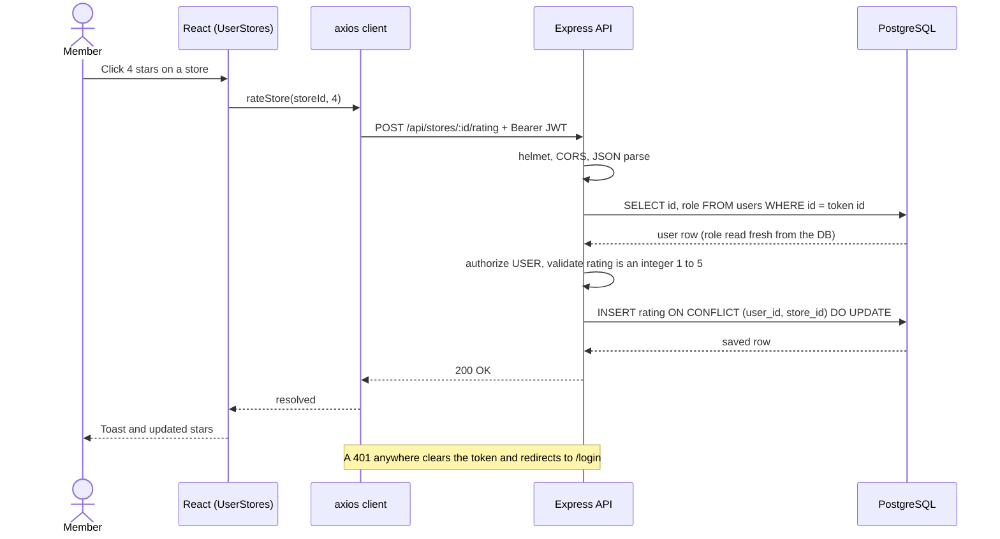
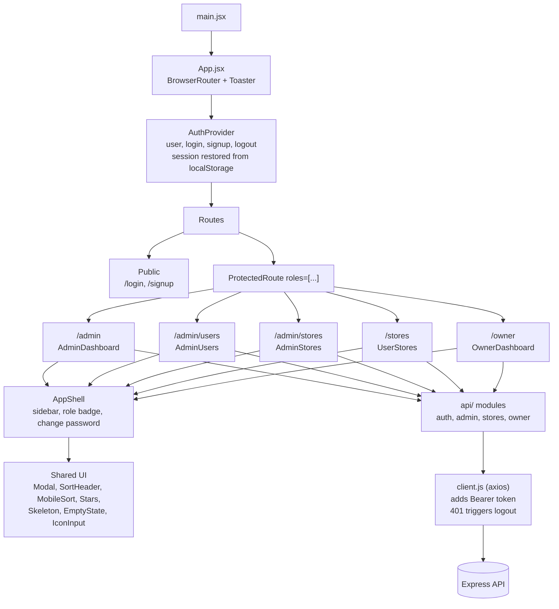

<div align="center">

# Ledger

### Every store earns its stars.

A role-based store rating platform. One login, three roles, one shared ledger of ratings.


**Live demo:** `https://YOUR-APP.vercel.app` &nbsp;|&nbsp; **API health:** `https://YOUR-API.onrender.com/api/health`

*(Replace the two links above after you deploy. See [docs/DEPLOYMENT.md](docs/DEPLOYMENT.md).)*

</div>

---

## Why Ledger?

Most rating apps treat every visitor the same. Ledger is built around a simple idea: **a rating is an entry in a ledger, and different people need different views of the same ledger.**

| Role | Their view of the ledger |
|---|---|
| **Administrator** | The whole book: totals, every user, every store, full control (add, edit, delete). |
| **Store Owner** | Their own pages: average rating plus exactly who rated their store, and when. |
| **Member** | The public face: discover stores, give a 1-5 star rating, change it any time. |

One login screen routes each person to the right workspace. The server enforces the roles, not just the UI.

---

## Screenshots

| Login | Admin overview |
|:---:|:---:|
|  |  |

| User management | Add user |
|:---:|:---:|
|  |  |

| Store management | Member: discover and rate |
|:---:|:---:|
|  |  |

| Owner dashboard |
|:---:|
|  |

---

## Features

**Administrator**
- Dashboard with animated totals (users, owners, stores, ratings), a role-distribution chart and a top-rated stores leaderboard
- Add, edit and delete users (Admin / Owner / Member) and stores; assign a store to an owner
- Filter by name, email, address and role; sort ascending or descending on every column
- User detail view; for a Store Owner it also shows their average rating

**Member (normal user)**
- Self sign-up and login; update password
- Search stores by name or address (debounced, so it does not fire a request per keystroke)
- See each store's overall rating and **your own** rating side by side
- Submit a 1-5 star rating, and modify it later (one rating per store, enforced by the database)

**Store Owner**
- Dashboard with the store's average rating and total ratings
- Table of every user who rated the store, sortable by user, email, rating and date
- Works with several stores per owner (store switcher)

**Across the app**
- Validation on both sides: name 20-60 characters, address up to 400, password 8-16 with one uppercase letter and one special character, standard email format
- Skeleton loaders, empty states, toast notifications, responsive layout with a mobile sort control

---

## Architecture

### 1. System overview

```mermaid
flowchart LR
    subgraph Client["Browser"]
        SPA["React 18 SPA<br/>Vite build"]
    end

    subgraph Vercel["Vercel (static hosting)"]
        CDN["dist/ assets<br/>SPA rewrite to index.html"]
    end

    subgraph Render["Render (Node web service)"]
        direction TB
        SEC["helmet + CORS<br/>JSON body limit"]
        RL["Rate limiter<br/>login and signup"]
        AUTH["authenticate<br/>JWT verify + role re-check"]
        RBAC["authorize(role)"]
        VAL["express-validator"]
        CTRL["Controllers<br/>auth, admin, store, owner"]
        SEC --> RL --> AUTH --> RBAC --> VAL --> CTRL
    end

    subgraph Neon["Neon (managed PostgreSQL)"]
        DB[("users<br/>stores<br/>ratings")]
    end

    CDN -- serves --> SPA
    SPA -- "HTTPS + JSON<br/>Authorization: Bearer JWT" --> SEC
    CTRL -- "pg Pool<br/>parameterized SQL, SSL" --> DB
```



### 2. Request lifecycle: a member rates a store



### 3. Database design (ER diagram)

```mermaid
erDiagram
    USERS ||--o{ RATINGS : submits
    STORES ||--o{ RATINGS : receives
    USERS |o--o{ STORES : owns

    USERS {
        int id PK
        varchar name "20 to 60 chars (CHECK)"
        varchar email UK
        text password_hash "bcrypt"
        varchar address "max 400"
        user_role role "ADMIN, USER, OWNER"
        timestamptz created_at
    }
    STORES {
        int id PK
        varchar name "20 to 60 chars (CHECK)"
        varchar email UK
        varchar address "max 400"
        int owner_id FK "ON DELETE SET NULL"
        timestamptz created_at
    }
    RATINGS {
        int id PK
        int user_id FK "ON DELETE CASCADE"
        int store_id FK "ON DELETE CASCADE"
        smallint rating "CHECK 1 to 5"
        timestamptz created_at
        timestamptz updated_at
    }
```



`UNIQUE (user_id, store_id)` on `ratings` guarantees one rating per member per store, which turns "modify my rating" into a single atomic upsert. Averages are never stored; they are computed with `AVG()` so they can never go stale.

### 4. Frontend architecture



### 5. Role-based access matrix

| Capability | Admin | Owner | Member | Public |
|---|:---:|:---:|:---:|:---:|
| Sign up / log in | | | | yes |
| Update own password | yes | yes | yes | |
| Dashboard totals, user and store lists | yes | | | |
| Create / edit / delete users and stores | yes | | | |
| View a user's details | yes | | | |
| Browse and search stores, rate (1-5) | | | yes | |
| See who rated my store + average | | yes | | |

Enforced on the server by `authenticate` (who are you?) then `authorize(...)` (are you allowed?). Not logged in returns `401`; wrong role returns `403`.

---

## Project structure

```
ledger/
├── README.md
├── docs/
│   ├── DEPLOYMENT.md              step-by-step production deployment
│   └── screenshots/
├── backend/
│   ├── package.json
│   ├── .env.example
│   ├── sql/
│   │   └── schema.sql             tables, constraints, indexes
│   ├── scripts/
│   │   ├── initdb.js              npm run db:init  (creates tables)
│   │   └── seed.js                npm run seed     (demo data)
│   └── src/
│       ├── server.js              starts the HTTP server
│       ├── app.js                 middleware stack, routes, error handler
│       ├── config/db.js           pg Pool (SSL switch via DB_SSL)
│       ├── middleware/
│       │   ├── auth.js            authenticate + authorize(role)
│       │   └── validate.js        turns validation errors into a 400
│       ├── validators/rules.js    name, email, address, password, rating rules
│       ├── utils/query.js         ORDER BY whitelist, safe ILIKE filters, parseId
│       ├── routes/                auth, admin, store, owner
│       └── controllers/           auth, admin, store, owner
└── frontend/
    ├── index.html
    ├── vite.config.js             vendor / charts / motion chunk splitting
    ├── vercel.json                SPA rewrite
    ├── .env.example
    └── src/
        ├── main.jsx, App.jsx      entry + routes
        ├── api/                   client.js (axios), auth, admin, stores, owner
        ├── context/AuthContext.jsx
        ├── routes/ProtectedRoute.jsx
        ├── hooks/                 useDebounce, useCountUp
        ├── utils/                 validators.js (mirrors backend), format.js
        ├── components/            AppShell, AuthLayout, Modal, ConfirmModal,
        │                          ChangePasswordModal, IconInput, FormField,
        │                          SortHeader, MobileSort, Stars, Avatar,
        │                          Skeleton, EmptyState
        ├── pages/
        │   ├── Login.jsx, Signup.jsx
        │   ├── admin/             AdminDashboard, AdminUsers, AdminStores
        │   ├── user/              UserStores
        │   └── owner/             OwnerDashboard
        └── styles/                index.css, layout.css
```

---

## Tech stack

| Layer | Choice | Why |
|---|---|---|
| UI | React 18, React Router 6 | Role-based routes with a `ProtectedRoute` guard |
| Build | Vite 5 | Fast dev server; vendor, charts and motion split into cached chunks |
| Styling | Hand-written CSS (glass dark theme) | No UI framework; consistent design tokens |
| Motion and charts | Framer Motion, Recharts, Lucide | Count-up numerals, role pie chart, icons |
| Feedback | react-hot-toast | Non-blocking success and error messages |
| HTTP | axios (single configured instance) | One place for the base URL, token header and 401 handling |
| API | Express 5 | Small, explicit middleware pipeline |
| Database | PostgreSQL via `pg` | Constraints, enums, joins and aggregates do real work |
| Auth | bcrypt + JWT | Salted password hashes; stateless sessions |
| Security | helmet, CORS allow-list, express-rate-limit, express-validator | See below |

---

## Security model

| Concern | How it is handled |
|---|---|
| Password storage | bcrypt hash (cost 10); `password_hash` is never returned by any endpoint |
| Session | JWT with expiry; the role is **re-read from the database on every request**, so a deleted user or changed role takes effect immediately |
| Privilege escalation | Sign-up hard-codes role `USER`; only admin endpoints can assign roles; an admin cannot demote or delete themselves |
| SQL injection | Parameterized queries everywhere; `ORDER BY` columns chosen from a whitelist, never interpolated from input |
| LIKE injection | `%`, `_` and `\` are escaped so search text is matched literally |
| Brute force | Login and sign-up limited to 50 attempts per 15 minutes per IP |
| Input validation | Backend validates every field (the frontend validation is only for UX) |
| Account enumeration | Login returns one generic message for "unknown email" and "wrong password" |
| IDOR | The owner dashboard derives the store from the verified token and only accepts a `storeId` that belongs to that owner |
| Headers and CORS | `helmet()` defaults; CORS allows only the configured `CLIENT_URL` |
| Data integrity | `CHECK` constraints (rating 1-5, name length), `UNIQUE (user_id, store_id)`, foreign keys with deliberate `ON DELETE` rules |

---

## API reference

Base URL: `/api`. Protected routes need `Authorization: Bearer <token>`.

| Method | Endpoint | Role | Purpose |
|---|---|---|---|
| GET | `/health` | public | API and database health |
| POST | `/auth/signup` | public | Register a Member |
| POST | `/auth/login` | public | Returns `{ user, token }` |
| PUT | `/auth/password` | any | Change own password |
| POST | `/auth/logout` | any | Acknowledge logout (client drops the token) |
| GET | `/admin/dashboard` | Admin | Totals by entity and role |
| GET | `/admin/users` | Admin | List; filters `name, email, address, role`; sort `sortBy, order` |
| POST | `/admin/users` | Admin | Create a user with any role |
| GET | `/admin/users/:id` | Admin | Details (Owner includes `rating`) |
| PUT | `/admin/users/:id` | Admin | Update (blank password keeps the current one) |
| DELETE | `/admin/users/:id` | Admin | Delete (cannot delete yourself) |
| GET | `/admin/stores` | Admin | List with average rating and owner name |
| POST | `/admin/stores` | Admin | Create, optionally assigning an owner |
| PUT | `/admin/stores/:id` | Admin | Update |
| DELETE | `/admin/stores/:id` | Admin | Delete |
| GET | `/stores` | Member | Stores with `overall_rating` and `my_rating`; `search`, sort |
| POST | `/stores/:id/rating` | Member | Submit or modify a rating (upsert) |
| GET | `/owner/dashboard` | Owner | Store, average, raters; optional `storeId`, sort |

Error shape: `{ "message": "...", "errors": [{ "field": "...", "message": "..." }] }` with `400` validation, `401` unauthenticated, `403` forbidden, `404` not found, `409` duplicate email.

---

## Run it locally

Prerequisites: Node.js 18+, PostgreSQL 14+.

```bash
# 1. Database
createdb store_rating
cd backend && cp .env.example .env        # then edit DATABASE_URL and JWT_SECRET
npm install
npm run db:init                           # creates the tables
npm run seed                              # demo data

# 2. Backend  -> http://localhost:5000
npm run dev

# 3. Frontend -> http://localhost:5173
cd ../frontend && cp .env.example .env
npm install && npm run dev
```

Use `localhost` (not `127.0.0.1`) in the browser, because `CLIENT_URL` in the backend `.env` must match the origin exactly.

### Demo accounts

| Role | Email | Password |
|---|---|---|
| Administrator | `admin@example.com` | `Test@1234` |
| Store Owner | `owner@example.com` | `Test@1234` |
| Member | `user1@example.com` | `Test@1234` |

### Environment variables

| File | Variable | Meaning |
|---|---|---|
| backend/.env | `PORT` | API port (hosting platforms set this for you) |
| | `DATABASE_URL` | PostgreSQL connection string |
| | `DB_SSL` | `true` for Neon / Render / Supabase, `false` locally |
| | `JWT_SECRET` | Long random string (the server refuses to start without it) |
| | `JWT_EXPIRES_IN` | Token lifetime, e.g. `1d` |
| | `CLIENT_URL` | Exact frontend origin allowed by CORS |
| frontend/.env | `VITE_API_URL` | API base URL including `/api` (read at build time) |

---

## Deploy

Recommended free setup: **Vercel** (frontend) + **Render** (API) + **Neon** (PostgreSQL). The full walkthrough, with a troubleshooting table, is in [docs/DEPLOYMENT.md](docs/DEPLOYMENT.md).

---

## Design decisions and trade-offs

| Decision | Reasoning | Trade-off |
|---|---|---|
| Single `users` table with a role enum | One login path for every role | A person cannot hold two roles at once |
| Average rating computed, not stored | Always correct, no sync bugs | Slightly more work per read (indexed join) |
| Upsert for ratings | Atomic, race-safe, one rating per user per store | Rating history is not kept |
| JWT in `localStorage` | Simple SPA-to-API setup across two domains | Exposed to XSS; httpOnly cookies are the hardening step |
| Stateless logout | No session store to run | A stolen token is valid until it expires (mitigated by the per-request DB role check) |
| Filtering and sorting in SQL | Correct on any dataset size | Needs pagination once data grows |

## Roadmap

- Server-side pagination for the admin tables
- httpOnly refresh-token cookies and token revocation
- Review text and photos alongside star ratings
- Automated tests (Jest + Supertest for the API, Vitest for the UI)
- CI pipeline (lint, test, build) on every pull request

---

<div align="center">

Built with React, Express and PostgreSQL.

</div>
